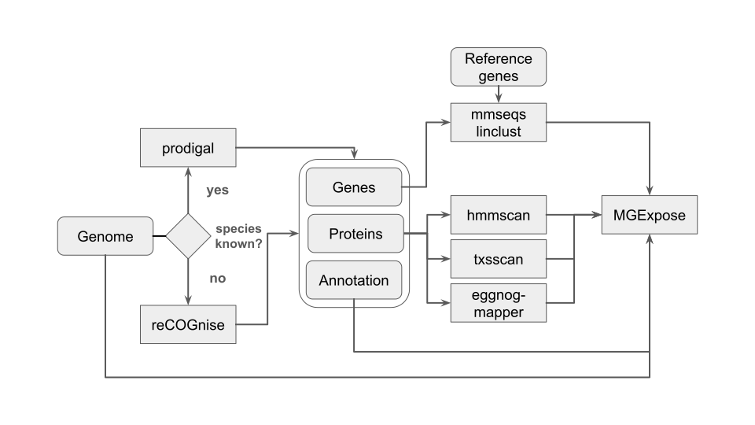

# proMGEflow: recombinase-based detection of mobile genetic elements in prokaryotes

Blahblah.



Dependencies
------------


`proMGEflow` is implemented in `nextflow` and `python`. Dependencies are available as docker containers

- nextflow
- python
- prodigal
- mmseqs2
- eggnog-mapper
- hmmer
- MACsyfinder/txsscan
- MGExpose
- reCOGnise

Installation
------------

### Databases

`proMGEflow` requires the following databases:

1. eggnog-mapper database (48GB)
	```
	mkdir -p /path/to/emapper_db && cd /path/to/emapper_db
	wget http://eggnog6.embl.de/download/emapperdb-5.0.2/eggnog.db.gz
	wget http://eggnog6.embl.de/download/emapperdb-5.0.2/eggnog_proteins.dmnd.gz
	wget http://eggnog6.embl.de/download/emapperdb-5.0.2/eggnog.taxa.tar.gz
	gunzip eggnog.db.gz
	gunzip eggnog_proteins.dmnd.gz
	tar xvzf eggnog.taxa.tar.gz
	```

2. txsscan models (50MB)
	```
	mkdir -p /path/to/txsscan_models && cd /path/to/txsscan_models
	git clone https://github.com/macsy-models/TXSScan.git TXSS
	```
3. recombinase HMMs -- from Zenodo
4. recognise marker set -- from Zenodo
5. pangenome cluster reference sequences -- from Zenodo

Usage
-----

```
nextflow run grp-bork/promgeflow --input_dir /path/to/input/genome/fasta/files --output_dir /path/to/output
```

### Input

`proMGEflow` takes as input a set of input genome fasta files. The input files must be stored / linked into a directory, which can be supplied to the workflow via the `--input_dir` parameter. Input genome files can be gzipped and should have a common file ending (default `.fna`). The file ending can be supplied to the workflow via the `--file_pattern` parameter (e.g. `--file_pattern '*.fasta'`).

### Output

TBD

