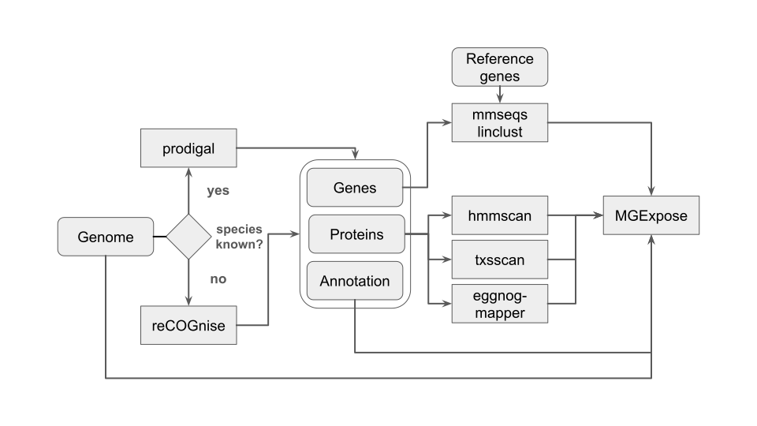

# proMGEflow: recombinase-based detection of mobile genetic elements in prokaryotes

`proMGEflow` can detect and annotate mobile genetic elements (MGEs) in prokaryotic genomes based on the presence of recombinase signatures.



Dependencies
------------


`proMGEflow` is implemented in `nextflow` and `python`. Dependencies are available as docker containers

- nextflow
- python
- prodigal
- mmseqs2
- eggnog-mapper
- hmmer
- MACsyfinder
- MGExpose
- reCOGnise

Installation
------------

### Databases

`proMGEflow` requires the following databases:

1. eggnog-mapper database (48GB)
	```
	mkdir -p /path/to/emapper_db && cd /path/to/emapper_db
	wget http://eggnog6.embl.de/download/emapperdb-5.0.2/eggnog.db.gz
	wget http://eggnog6.embl.de/download/emapperdb-5.0.2/eggnog_proteins.dmnd.gz
	wget http://eggnog6.embl.de/download/emapperdb-5.0.2/eggnog.taxa.tar.gz
	gunzip eggnog.db.gz
	gunzip eggnog_proteins.dmnd.gz
	tar xvzf eggnog.taxa.tar.gz
	```

2. conjscan models (50MB)
	```
	mkdir -p /path/to/conjscan_models && cd /path/to/conjscan_models
	git clone https://github.com/macsy-models/CONJScan.git CONJ
	cd CONJ
	git checkout d5fc1e3724362cb14c03a6e2f6de879bbdf3f64e
	# ignore the "detached" head message
	```

3. recombinase HMMs (1.7MB)
	```
	mkdir -p /path/to/recombinase_models && /path/to/recombinase_models
	wget https://zenodo.org/records/15829523/files/promge_v1_recombinase_models.hmm.gz
	```

4. recognise marker set (1GB)
	```
	mkdir -p /path/to/recognise_markers && cd /path/to/recognise_markers
	wget https://zenodo.org/records/17916463/files/recognise_markers.tar.gz
	tar cvzf recognise_markers.tar.gz
	```

5. pangenome cluster reference sequences (38.9GB)
	```
	mkdir -p /path/to/cluster_ref_seqs && cd /path/to/cluster_ref_seqs
	wget https://zenodo.org/records/17704403/files/sp095_refdb_v1ypg3.tar
	# Do not untar the .tar file!
	```

Usage
-----

### Run Modes

#### `deNovo`: pangenome-based MGE annotation in isolate genomes and binned metagenomes

This is the default mode.

### Input

#### Via input directory

```
nextflow run grp-bork/promgeflow --input_dir /path/to/input/genome/fasta/files --output_dir /path/to/output
```

`proMGEflow` takes as input a set of input genome fasta files. The input files must be stored / linked into a directory, which can be supplied to the workflow via the `--input_dir` parameter. Input genome files can be gzipped and should have a common file ending (supported are `.fa`, `.fasta`, and `.fna`, with or without `.gz` suffix).

#### Via samplesheet

```
nextflow run grp-bork/promgeflow --input_sheet /path/to/input-sheet.tsv --output_dir /path/to/output
```

Alternatively, you can supply a samplesheet via the `--input_sheet` parameter. This must be a tab-separated text file with the following columns (without headers):

1. specI cluster id or "unknown" if not known
2. genome id
3. path to genome fasta (.fna)

If gene annotations are already available for the input genome, you can supply them via columns 4-6:

4. path to protein fasta (.faa)
5. path to gene fasta (.ffn)
6. path to (prodigal) gff (.gff)

Additionally, precomputed functional annotations can be specified as well:

7. eggnog-mapper output (.tsv)


#### `contig`: MGE annotation within contig boundaries

This mode is designed to detect and annotate MGEs on short sequences or small sets of short contigs, such as generated when assembling plasmids. It is activated setting the `--run_mode` parameter to `contig`. It treats input contigs as potential mobile regions and thus requires no pangenome estimation as no islands have to be delineated. Nevertheless, the resulting MGE candidates will only span the region between the outermost genes on the contig.

Input sequences must be provided in one fasta file per genomic unit (e.g. a set of contigs/scaffolds from a plasmid assembly). Sequences can be pre-filtered by length using the `--max_contig_length` parameter.  If a samplesheet is provided, the `specI cluster` column has to be set to `contig` for each input file:

```
contig  <genome_1>   /path/to_fasta/with_contigs/of_genome_1
contig  <genome_2> /path/to/fasta_with_contigs_of_genome_2
```


* Running in contig-mode via input directory

```
nextflow run grp-bork/promgeflow --run_mode contig --input_dir /path/to/input/genome/fasta/files --output_dir /path/to/output
```

* Running in contig-mode via samplesheet

```
nextflow run grp-bork/promgeflow --run_mode contig --input_sheet /path/to/input-sheet.tsv --output_dir /path/to/output
```


### Output

```
<params.output_dir>/
├── <specI>
│   ├── <genome_1>
│   │   ├── <genome_1>.faa
│   │   ├── <genome_1>.ffn
│   │   ├── <genome_1>.gff
│   │   ├── <genome_1>.gene_info.txt
│   │   ├── <genome_1>.mge_islands.ffn.gz
│   │   ├── <genome_1>.mge_islands.gff3
|   |  -OR-
│   │   └── <genome_1>.predicted_recombinase_mges.gff3
│   ├── <genome_2>
...
├── genome_status.txt
└── pangenome_summary.txt
```

#### MGE annotation outputs

##### Per Genome

Upon successful MGE detection in an input genome `proMGEflow` returns a gff with the annotated MGEs (`<genome_id>.mge_islands.gff3`) and the extracted sequences of those MGEs (`<genome_id>.mge_islands.ffn.gz`) as well as a set of gene coordinates (`<genome_id>.gff`), gene (`<genome_id>.ffn`) and protein sequences (`<genome_id>.faa`) as predicted by `prodigal`. In case gene predictions were already provided as inputs (cf. [Input via samplesheet](#via-samplesheet)), the "`prodigal`" outputs returned by `proMGEflow` are identical to the input data. The `<genome_id>.mge_islands.gff3` contains predicted MGEs as `mobile_genetic_element` records and all genes (as `gene` records) associated to those islands. In addition, the output includes another file with the annotations of all genes contained in the input genome (`<genome_id>.gene_info.txt`).

In case of an unsuccessful pangenome analysis (and subsequentially a failed island detection), `proMGEflow` may still return a set of predicted MGE recombinases (`<genome_id>.predicted_recombinase_mges.gff3`) in the input genome, given any are found. This allows the user to investigate the genomic neighbourhoods of the discovered recombinases and draw their own conclusions.

By default, output is sorted in directory trees of the pattern `<specI>/<genome>/` in order to not flood the output directory with massive numbers of genome-specific directories. If this behaviour is not desired, it can be turned off by setting the `--simple_output` parameter.

##### Run summaries

For each run, `proMGEflow` produces up to two run summaries.

* Genome status summary

```
#species	genome	has_genes	has_species	has_ref_clusters	has_recombinases	has_functional	has_conjugation	has_pangenome	has_mges
specI_v4_00271	GCA_000007065.1	true	true	true	true	true	false	true	true
specI_v4_01172	GCA_000007005.1	true	true	true	true	true	false	true	true
specI_v4_02779	GCA_000007225.1	true	true	true	true	true	false	true	true
```

The file`genome_status.txt` contains a tab-separated table providing information of each input record through the workflow. The columns are:

1. species

The specI_v4 cluster id assigned to the input record, or `contig` or `unknown`

2. genome

The genome_id of the input record

3. has_genes

`true` if prodigal-based gene predictions were successful or if gene predictions were provided as input

4. has_species

`true` if the assigned specI_v4 cluster is not `unknown`

5. has_ref_clusters

`true` if the assigned specI_v4 cluster has a reference gene cluster in the gene cluster database, thus enabling pangenome analysis

6. has_recombinases

`true` if MGE recombinase signals were found

7. has_functional

`true` if eggnog-mapper annotation was successful, leading to cargo data and, potentially, detection of phage structural signals

8. has_conjugation

`true` if macsyfinder was able to find matches to the conjscan models

9. has_pangenome

`true` if pangenome gene clustering was successful

10. has_mges

`true` if mge annotation with mgexpose was successful


* Pangenome summary

```
#species	genome	n_genes	n_accessory	n_core	%acc	n_genomes
specI_v4_00271	GCA_000007065.1	3477	1669	1808	48.00	73
specI_v4_01172	GCA_000007005.1	3281	1678	1603	51.14	14
specI_v4_02779	GCA_000007225.1	2631	16	2615	0.61	6
```

The file `pangenome_summary.txt` contains information from the pangenome estimation analysis. This file is not produced in `contig` mode or if the pangenome clustering was not successful for all input genomes (`has_pangenome = false`). The file is a tab-separated table with the following columns:

1. specI

The specI_v4 cluster id assigned to the input genome

2. genome

The genome_id of the input genome

3. n_genes

The number of genes called in the input genome

4. n_accessory

The number of genes in the input genome identified as "accessory" 

5. n_core

The number of genes in the input genome identified as "core" 

6. %acc

Percentage of accessory genes in the input genome

7. n_genomes

Number of genomes contributing to the specI_v4 reference cluster


